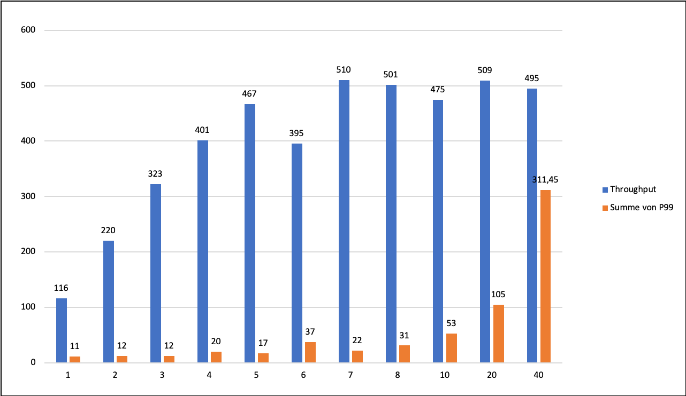
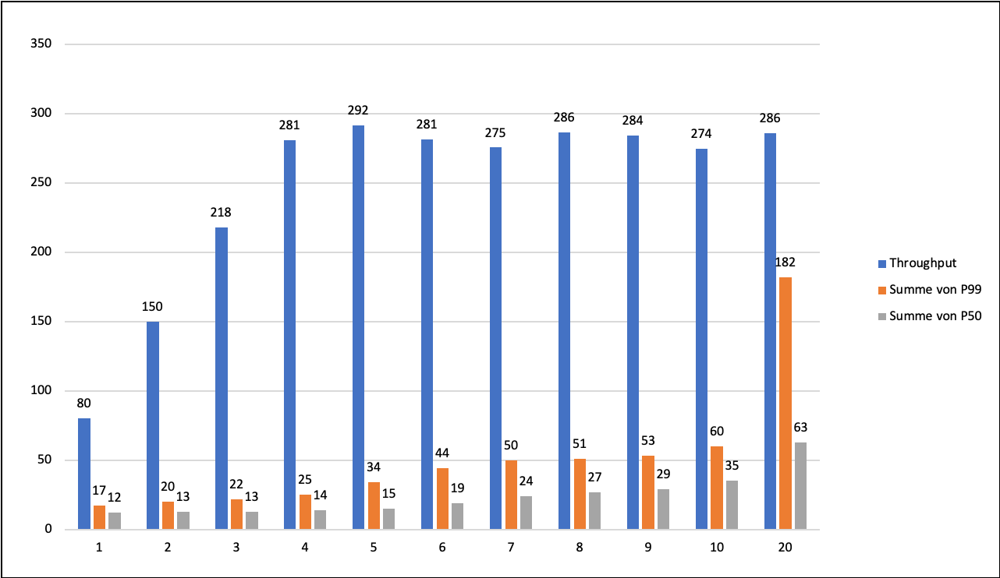

This repo is a playground for some tests with Apache Jena and Fuseki.
The code is neither clean nor in any way beautiful....

Following classes are provided:

### RDFDatabaseInitializer

Reads the template file test.ttl.template and substitutes the variables within ${} by randomized values.
The so instantiated turtle representation is persisted in a Fuseki store expected to run at http://localhost:3031/ds

The number of samples generated is controlled by a command line parameter.

From project root run with: 
` mvn exec:java -Dexec.mainClass="RDFDatabaseInitializer" -Dexec.args="<nr of samples>"` 

### QueryBench
Runs a query benchmark against a specified SPARQL endpoint.
It reads 10000 ids from the database and then randomly samples from this list ids. For each sampled id a query is submitted retrieving all triples defined for that id.
That approach minimizes that the test will be influenced by caching.

From the command line the number of threads and the test execution time can be controlled.

` mvn exec:java -Dexec.mainClass="QueryBench" -Dexec.args="10 30 http://localhost:3031/ds"` 

runs the test with 10 threads for 30 seconds against the SPARQL endpoint http://localhost:3031/ds
Metrics are appended to the CSV file results.csv

### RDFQuery
Executes hard coded SPARQL queries against the SPARQL endpoint http://localhost:3031/ds
`mvn exec:java -Dexec.mainClass="RDFQuery" `

### Results from running some performance tests

I performed some benchmarks with rdf-delta an "extension" to Apache Fuseki facilating a HA setup for Fuseki.
The documentation and link to the Git repo is available here: https://afs.github.io/rdf-delta/

**Setup**
- rdf-delta running on a Macbook Pro , 2.7 Ghz, Quadcore, Intel Core i7, 16GB memory
- Benchmark client (QueryBench) running on a Win10 PC, 8 core, 32GB memory
- 1 GB LAN

Run a rdf-delta patchlog server:
`dcmd server --store patchlogserver`

Run the Fuseki server with a TDB2 database (using the configuration provided in the resource folder, copied to the Tutorial folder in rdf-delta): `dcmd fuseki --port 3031 --conf Tutorial/fuseki-config.ttl 

After populating the database with the intended number of publications (RDFDatabaseInitializer) run the benchmark (QueryBench)
The file result.csv in resources contains the results from a number of test runs with various number of triples, number of threads.

Test results and 99% percentile latency for 250.000 triples

Max throughput is reached at arond 500 queries / second with a 20ms (99% percentile) and 13ms (50% percentile) latency 

Test results 99% percentile latency for 1.000.000 triples

Max throughput is reached at around 290 queries / sec with a 99% percentile latency of aroung 32msecs and a 50% percentile latency of 15ms 50% .

